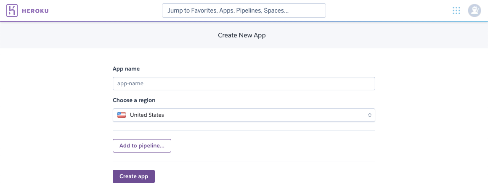

# 1. Create new app
In this document, we are going to be learning how to create an app on Heroku **properly**. Creating an app sets the foundation for all of our work. So we need to be sure that this part is perfect.

## 1. Open Heroku
Go to Heroku website and sign in your account.

## 2. Click New button
After signing your Heroku account you should see this page. Click the **New** button on the top right.
 
  
 

## 3. Create new app
Click on **Create new app** from the list.
 
After fill up the app name click **Create app**
 

***

## Conclusion
If we have followed these steps correctly, we should have a new page that displays our app names, and various options below it. Good job! We now have an app.
