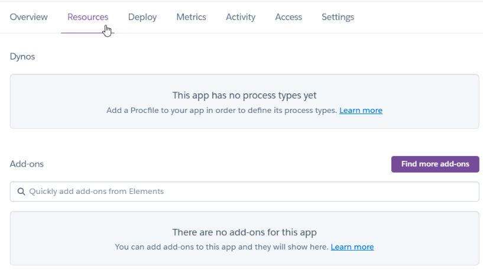
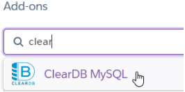
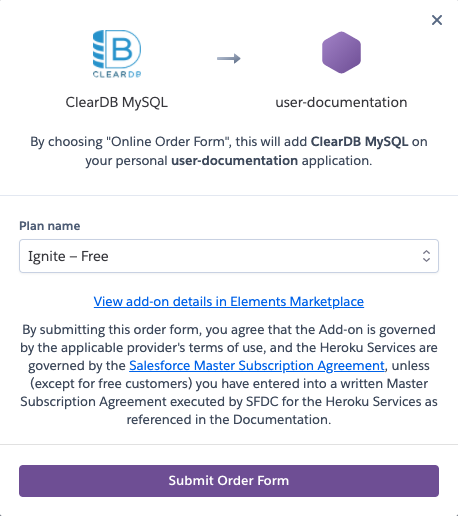
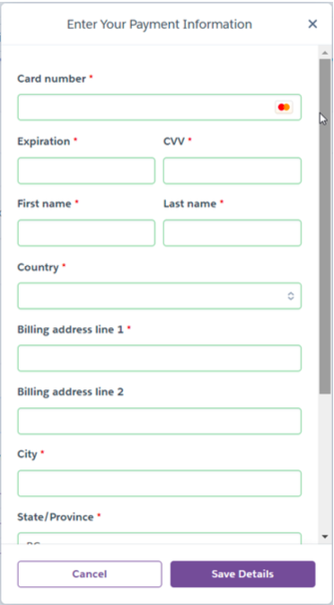

# Setting up ClearDB for your app
******

After you have created a new app, you can add some add-on. You can choose ClearDB to server as your database.

******

## 1.Go to Resources

On the top of your page, click on Resources tab.
 
 

 

## 2.Choose ClearDB MySQL

Look for **ClearDB MySQL** in the Add-Ons section
 
 

 

## 3.Select the plan

Select the plan name then click **Submit Order Form**
 
 

 

## 4.Associate a credit card

You will receive this popup if you have not associated a credit card to your account
 
 

 
Go to [this link](https://heroku.com/verify) and fill out the information form
 

## 5.Enter Payment Information
 

