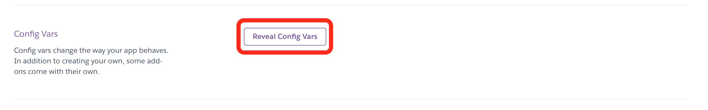
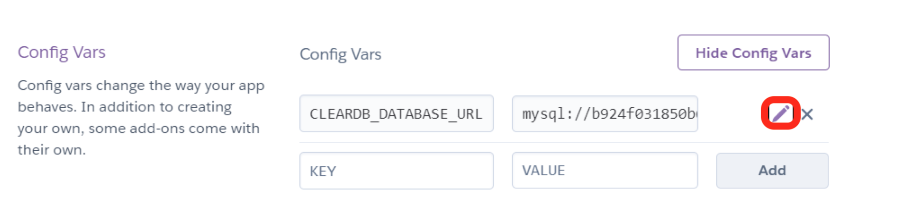
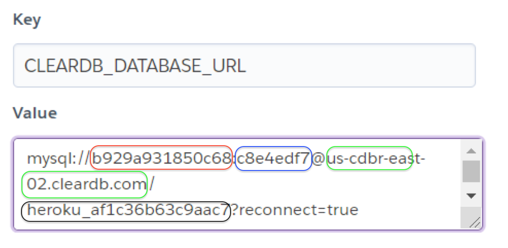

# Connect your app with the ClearDB database #

**1.** Once you have **created** clearDB for your database, we can now connect our app with the ClearDB database. Refer to the top of your Heroku application page, in the menu section, **click** _Settings_.   
 
 
 
**2.** Arriving at the Settings page, **find** the Config Vars (configurations variables) section below the application information. Then **click** _Reveal Config Vars_ to show the details



**3.** Sometimes configuration variables can be links and are too long for the section bar. **Find** the configuration that says _CLEARDB_DATABASE_URL_, and **click** the _pencil icon_ on the right to open up more details on the configuration.



**4.** After you open up the details, you should **see** the contents of your _CLEARDB_DATABASE_URL_ value



><span style="color:red">The value in red circle, represents user</span><br>
<span style="color:blue">The value in blue circle, represents password</span><br>
<span style="color:green">The value in green circle, represents host</span><br>
<span style="color:#f4d420">The value in black circle, represents database</span>

**5.** Using those values, you can set up your connection to the ClearDB database in your web application. Here is an example in Javascript, each above value will be set as a string to its corresponding key.

```javascript
const dbConfigHeroku = {
 host: "us-cdbr-east-02.cleardb.com",
 user: "b929a931850c68",
 password: "c8e4edf7",
 database: "heroku_af1c36b63c9aac7",
 multipleStatements: false,
 reconnect: true
};
```

Using this configuration, now your web application will be able to connect to the ClearDB database.
